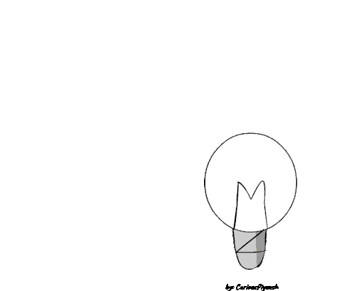

<h1 align="center">Hi 👋, I'm Sheikh Parvez</h1>
<h3 align="center">I'm a 3rd year CSE undergrad, pursuing B.Tech from Sharda University. I am also a Competitive Coder, Frontend Developer and Software Developer. I love working with Data Structures and Algorithms and enjoy solving problems.</h3>

  

  

  

&nbsp;

- 🌱 I’m currently learning **Mongodb, Node.js**

- 💬 Ask me about **C++, Python, Data Structures and Algorithm, HTML, CSS, JavaScript**

- 📫 How to reach me **parvezahmed.0947@gmail.com**

<h3 align="left">Connect with me:</h3>

<h3 align="left">Languages and Tools:</h3>

                

&nbsp;

&nbsp;

 

&nbsp;

